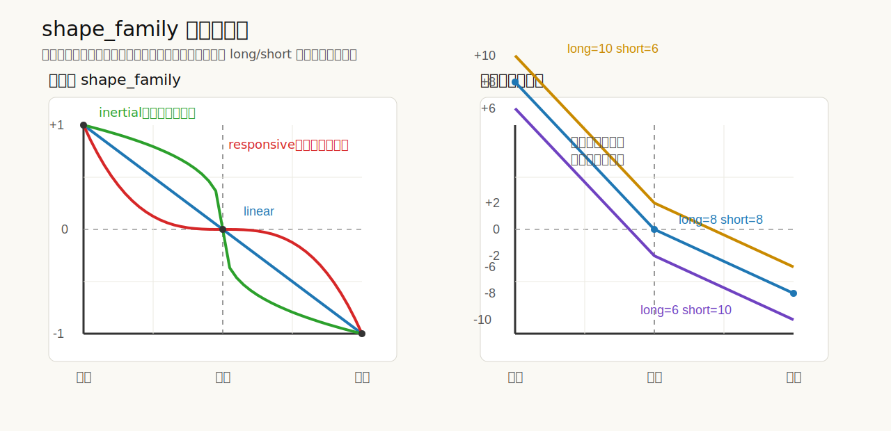

# Shape Family 对称设计

## 背景

当前策略实现把价格区间直接映射成一条从下沿走到上沿的单向曲线：

- 下沿对应最大多头
- 上沿对应最大空头
- `linear / convex / concave` 直接作用在整段区间

这种定义在 `linear` 下没有问题，但在非线性曲线下会出现一个明显问题：

- 从下沿往中间走的减仓节奏
- 从上沿往中间走的减仓节奏

并不一致。

这和当前用户心智模型不一致。用户预期是：

- 曲线应该以价格区间中点为对称轴
- 从上下两侧往中间走时，行为一致
- `偏多 / 偏空` 不是另一条曲线，而是同一条曲线整体上下移动
- 这个移动量由 `long_exposure_units` 和 `short_exposure_units` 自动推导，不单独配置

## 目标

- 把 `shape_family` 的语义改为“围绕中点对称的基准曲线”
- 让上下两侧往中间回归时的仓位变化节奏一致
- 让 `long_exposure_units` 和 `short_exposure_units` 只负责决定端点和整体偏移
- 让 `偏多 / 偏空 / 中性` 落到同一套公式和同一套测试上
- 用直接表达控仓行为的名字替代会误导的几何名

## 非目标

- 不改动带外策略 `out_of_band_policy`
- 不改动 `min_rebalance_units` 的语义
- 不引入新的独立偏移参数
- 不保留 `concave / convex` 的兼容层
- 不在本次设计里引入可调连续曲率参数
- 不在 README 和历史设计文档里重复精确曲率参数

## 设计结论

当前实现的问题，不是端点不对，而是中间过程不对。新的设计直接采用用户确认后的语义，不保留旧的单向曲线解释，也不继续使用会误导的几何命名。

这次变更必须作为一个完整的抽象变更落地：

- `shape_family` 的新名字
- `poise-core` 里的对称公式

必须在同一次实现里一起生效，不能先改名字、后改数学行为。否则同一个名字会在不同 commit 中对应不同语义，给回滚、排错和阅读历史带来额外复杂度。

新的策略语义分成两层：

1. 一条以价格区间中点为对称轴的基准曲线
2. 由 `long_exposure_units` 和 `short_exposure_units` 自动推导出的纵向偏移

对应直观解释如下：

- 曲线形状只回答：仓位往中间回归得快还是慢
- `long_exposure_units` 和 `short_exposure_units` 只回答：上下两端最多允许多少多头和空头
- `偏多 / 偏空` 不是换曲线，而是同一条曲线整体上下移动

## 核心设计

### 1. 先定义一条中点对称的标准曲线

先忽略偏多偏空，只看一条标准曲线。

这条曲线满足：

- 下沿是满多
- 中点是中性
- 上沿是满空
- 左右两侧完全对称

直观上就是：

- 从下沿往中间走，减多头有多快
- 从上沿往中间走，减空头就有同样快

### 2. `long_exposure_units` 和 `short_exposure_units` 只负责决定整条曲线落点

配置含义改成更直接的三点：

- `long_exposure_units` 决定下沿落点
- `short_exposure_units` 决定上沿落点
- 中点位置由这两个值自动推导

因此：

- 如果 `long_exposure_units = short_exposure_units`
  - 中点就是 `0`
  - 曲线是中性
- 如果 `long_exposure_units > short_exposure_units`
  - 整条曲线上移
  - 中点在 `0` 上方
  - 曲线表现为偏多
- 如果 `long_exposure_units < short_exposure_units`
  - 整条曲线下移
  - 中点在 `0` 下方
  - 曲线表现为偏空

### 3. 数学表达

价格不再按“从下沿走到上沿的一次单向过程”建模，而是按“相对中点的位置”建模。

```text
center = (lower_price + upper_price) / 2
half_band = (upper_price - lower_price) / 2
u = clamp((price - center) / half_band, -1, 1)
```

其中：

- `u = -1` 表示下沿
- `u = 0` 表示中点
- `u = 1` 表示上沿

然后定义：

```text
span = (long_exposure_units + short_exposure_units) / 2
bias = (long_exposure_units - short_exposure_units) / 2
desired_exposure(price) = bias + span * h(u)
```

其中基准曲线 `h(u)` 满足：

```text
h(-1) = 1
h(0) = 0
h(1) = -1
h(-u) = -h(u)
```

这个定义有几个必须成立的结果：

- 下沿：`desired_exposure = long_exposure_units`
- 上沿：`desired_exposure = -short_exposure_units`
- 中点：`desired_exposure = bias`

### 4. 形状族命名与定义

新的名字直接表达控仓行为，而不是几何术语：

- `linear`
- `inertial`
- `responsive`

对应语义：

- `linear`
  - 从边缘往中间，均匀收仓
- `inertial`
  - 更恋边
  - 更久保留边缘仓位
  - 从上下两侧往中间收仓都更慢
- `responsive`
  - 更恋中
  - 更快回到中性附近
  - 从上下两侧往中间收仓都更快

这些名字描述的是交易行为，不描述几何性质。这样配置、协议和 TUI 暴露出去的名字本身就带语义，不需要再额外携带“只能按半边理解”的隐藏知识。

### 5. 基准曲线定义

标准族定义为：

```text
h(u) = -sign(u) * |u|^p
```

第一版固定三种取值：

- `linear`：`p = 1.0`
- `inertial`：`p = 1 / 3`
- `responsive`：`p = 3.0`

它们的区别只体现在“往中间收仓的快慢”，不改变：

- 价格带边界
- 上下沿端点
- 中点偏移规则
- 带外语义

参数持有边界：

- 精确曲率参数 `p` 只在本设计和 `core/src/strategy.rs` 中作为一等知识维护
- README、历史设计文档和 TUI 只解释定性行为，不重复写死 `1 / 3`、`3.0` 这类实现细节
- 如果后续需要微调强度，应优先修改 `core` 和本设计，再决定是否同步示意图

这组参数刻意比最初讨论时更强，目的不是追求图形上的好看，而是让 `shape_family` 在控制仓位时有足够明显的差异：

- `inertial` 要明显更恋边
- `responsive` 要明显更恋中
- 差异不能只停留在轻微修饰，否则很难达到控制仓位的目的

### 5.1 图示

下面这张图同时表达两件事：

- 左图：`linear / inertial / responsive` 都必须围绕中点对称
- 右图：`long_exposure_units / short_exposure_units` 改变时，不是换一条新曲线，而是把同一条基准曲线整体上移或下移



### 6. 直观示例

#### 6.1 中性

```text
long_exposure_units = 8
short_exposure_units = 8
```

则：

- 下沿：`+8`
- 中点：`0`
- 上沿：`-8`

在“离中点还有一半距离”的位置上，三种形状的目标仓位大致为：

- `inertial`：`+6.35`
- `linear`：`+4.00`
- `responsive`：`+1.00`

这体现的是：

- `inertial` 明显更久保留边缘仓位
- `responsive` 明显更快往中性回归

#### 6.2 偏多

```text
long_exposure_units = 10
short_exposure_units = 6
```

则：

- 下沿：`+10`
- 中点：`+2`
- 上沿：`-6`

#### 6.3 偏空

```text
long_exposure_units = 6
short_exposure_units = 10
```

则：

- 下沿：`+6`
- 中点：`-2`
- 上沿：`-10`

### 7. 对外解释方式

文档和 UI 不再强调“单向曲线从下沿一路走到上沿”，而是统一解释为：

- 价格在区间中点以下时，系统按对称规则逐步展开多头
- 价格在区间中点以上时，系统按同样的对称规则逐步展开空头
- `shape_family` 决定回到中性有多快
- `long_exposure_units / short_exposure_units` 决定曲线整体偏向哪一侧

## 迁移策略

本项目当前处于探索阶段，本次直接改接口名，不保留旧名字兼容层。

因此：

- 配置文件、协议和 TUI 统一接受并展示：
  - `linear`
  - `inertial`
  - `responsive`
- `concave` 和 `convex` 直接视为废弃值，解析时报错
- 使用旧名字配置生成的持久化 runtime snapshot 不提供兼容恢复
- 旧实现里的非对称行为不再保留

这意味着：

- 配置值需要显式迁移：
  - `concave -> inertial`
  - `convex -> responsive`
- 如果本地已有基于 `concave / convex` 配置生成的持久化状态，升级前必须清理；升级后的配置会生成新的 `restore_revision`，恢复时应明确因 revision 不匹配而失败
- README、协议测试、engine 持久化测试和 TUI 相关测试必须一起更新，避免名字和行为再次脱节

## 验收测试

至少补齐以下验收：

1. 中性配置下，`linear` 在中点返回 `0`
2. 中性配置下，任意距离中点相同的左右价格点，目标仓位互为相反数
3. `inertial` 在上下两侧都比 `linear` 更久保留边缘仓位
4. `responsive` 在上下两侧都比 `linear` 更快回到中性
5. 偏多配置下，曲线整体上移，但形状不变
6. 偏空配置下，曲线整体下移，但形状不变
7. 下沿始终等于 `+long_exposure_units`
8. 上沿始终等于 `-short_exposure_units`
9. `shape_family = "inertial" / "responsive"` 能通过配置和协议边界
10. `shape_family = "concave" / "convex"` 被明确拒绝，并给出迁移提示
11. 基于旧 `concave / convex` 配置生成的持久化 snapshot 会因 `restore_revision` 不匹配而被拒绝恢复

## 影响范围

- `core/src/strategy.rs`
  - 重写 `desired_exposure`
  - 更新 `ShapeFamily`
  - 更新策略测试
- `application/src/track_definition.rs`
  - 更新默认值与枚举测试的期望
- `protocol/src/lib.rs`
  - 更新 `ShapeFamily` 枚举、显示值和协议测试
- `server/src/projector.rs`
  - 更新 core 到 protocol 的 `ShapeFamily` 映射
- `server/src/config.rs`
  - 更新配置解析和迁移错误信息
- `engine`
  - 锁住 `shape_family` 变化时的 restore revision 恢复边界
- `tui/src/main.rs`
  - 更新使用 `shape_family` 的联调配置夹具
- `README.md`
  - 更新配置示例和参数解释，但只保留定性行为
- `docs/superpowers/specs/2026-03-24-grid-strategy-family-design.md`
  - 增加“该节为历史记录，当前定义见 2026-04-10 设计”的说明，不再复制当前定义

## 开放问题

本次设计不处理以下问题，后续如有需要再单独设计：

- 是否开放连续 `shape_param`
- UI 是否要给 `inertial / responsive` 增加更短的中文辅助说明
- 是否在图表或 TUI 中直接展示目标曲线预览
