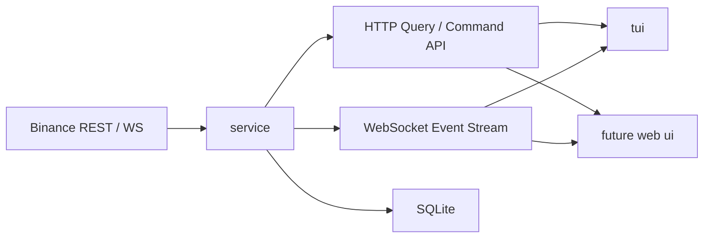

# 网格平台技术架构

本文档从全 Rust 形态重新定义项目的技术架构。重点不是描述“有哪些页面和接口”，而是明确系统应如何组织职责、状态、并发、持久化和客户端边界。

## 1. 目标与边界

### 1.1 产品目标

`grid-platform` 是一个面向 Binance USDⓈ-M Futures 的网格交易平台底座。

当前阶段的目标不是立刻追求完整实盘，而是先把下面五项基础能力搭稳：

- 单一核心服务，承载状态、控制面和后续策略运行
- 独立客户端体系，TUI 先行，Web UI 后续接入
- 稳定可演进的 HTTP / WebSocket 协议
- 可恢复、可审计、可验证的运行时模型
- 面向真实交易接入的可扩展服务端内核

### 1.2 当前业务边界

- 交易接入统一按 Binance USDⓈ-M Futures 建模
- TradeFi 资产按 USDⓈ-M 的符号子集处理
- 第一阶段只支持单实例、单账户、单 `symbol`
- TUI 是第一批客户端，但不是唯一客户端
- 未来增加 Web UI 时，不增加第二套后端

### 1.3 当前明确不做

- 多账户调度
- 多交易所抽象
- 公网权限系统
- 浏览器前端实现
- 复杂分布式部署
- 在线参数编辑平台

## 2. 架构原则

系统按以下原则设计：

1. `service` 是唯一的领域状态中心。
2. 所有领域状态变更都必须走单写者路径。
3. 客户端通过 `snapshot + incremental events` 同步状态，不自己回放恢复。
4. SQLite 负责持久化、恢复和审计，不充当实时消息总线。
5. `tui`、未来 `web ui` 都只是客户端，不拥有服务端业务逻辑。
6. 先保证单进程内核清晰，再考虑是否拆 crate 或拆进程。

## 3. 总体系统结构



核心理解：

- `service` 是系统核心
- `tui` 与未来 `web ui` 是两个独立客户端
- `SQLite` 是状态恢复与审计基座

## 4. 服务端技术架构

这里直接给出服务端内核的推荐结构与工程边界。

### 4.1 服务端分层

建议服务端保持单 crate，但内部按清晰分层组织：

1. `control_plane`
   - HTTP 路由
   - WebSocket 推送
   - 健康检查
2. `application`
   - 命令入口
   - 查询入口
   - 超时、重试、幂等控制
3. `kernel`
   - 单写者运行时
   - 领域状态聚合
   - 事件发布
4. `storage`
   - SQLite 模式
   - 仓储读写
   - 启动恢复
5. `integrations`
   - Binance REST / WS
   - 用户流 / 市场流 / 元数据
6. `strategy`
   - 网格配置
   - 网格状态机
   - 下单计划
7. `risk`
   - 风险阈值
   - breaker
   - 风险事件
8. `telemetry`
   - 日志
   - 指标
   - 诊断状态

### 4.2 并发模型

服务端不应允许多个异步任务直接改共享领域状态。推荐采用单写者模型：

- HTTP 命令请求进入 `CommandChannel`
- Binance 流事件进入 `MarketEventChannel`
- 恢复、超时、内部定时任务进入 `SystemEventChannel`
- 单一 `EngineLoop` 消费这些输入，并修改内存中的运行时状态
- 状态变更后产出 `DomainEvent`
- `DomainEvent` 同时驱动：
  - 持久化写入
  - WebSocket 广播
  - 查询视图刷新

这样做的目的：

- 保证状态一致性
- 降低锁粒度和竞态复杂度
- 让命令、行情、风控和恢复走同一条状态机路径

### 4.3 状态所有权

服务端内存中的权威状态建议聚合为单一 `RuntimeAggregate`，内部拆成几个子状态：

- `ConnectionState`
  - Binance REST / WS 健康
  - 用户流状态
  - stale / reconnect 信息
- `MarketState`
  - 标记价、最新价、session 信息
  - 元数据缓存
- `ExecutionState`
  - open orders
  - recent fills
  - pending commands
  - ack / failure / timeout
- `StrategyState`
  - grid config
  - active levels
  - occupied levels
  - pending rebuild
- `RiskState`
  - notional
  - threshold
  - stop / breaker / alerts
- `SystemState`
  - service mode
  - startup source
  - last snapshot version

### 4.4 命令流

命令建议统一走下面的生命周期：

1. 客户端发送 `CommandRequest`
2. 服务端生成 `command_id`
3. 命令进入 `EngineLoop`
4. 内核校验前置条件
5. 命令被标记为 `accepted / rejected`
6. 若命令需要下游动作，再进入执行路径
7. 最终产出 `ack / failed / timed_out`
8. 命令结果写入审计表并推送到 WebSocket

命令语义必须和领域状态联动，而不是只返回一个“接口成功”。

### 4.5 查询流

查询不应直接拼内存结构输出，而应明确查询模型：

- `/runtime/snapshot` 返回聚合快照
- `/orders/open` 返回执行层读模型
- `/fills/recent` 返回成交读模型
- `/risk/events` 返回风险事件读模型
- `/system/events` 返回系统事件读模型

未来 Web UI 接入时，应基于同一套查询模型做分页、过滤和多实例扩展。

### 4.6 当前工程边界

当前不建议为了抽象而继续拆更多 crate，原因很直接：

- 当前主要问题是内核清晰度，而不是 crate 数量
- 过早拆分会增加依赖和编译管理复杂度
- 先把控制面、内核、持久化和接入边界做实，再决定是否抽共享协议层更稳

## 5. 持久化与恢复策略

### 5.1 持久化原则

不采用纯事件溯源优先，也不采用只存一个大 JSON blob。建议使用“当前状态表 + 审计事件表”的混合模式：

- 当前状态表用于快速恢复和查询
- 审计事件表用于排障、回放和命令追踪

### 5.2 建议表模型

建议至少包含下面几类表：

- `runtime_snapshots`
- `open_orders`
- `fills`
- `commands`
- `risk_events`
- `system_events`
- 后续可增加 `grid_levels`

`commands` 表建议包含：

- `command_id`
- `command_type`
- `requested_at`
- `accepted_at`
- `ack_at`
- `failed_at`
- `timed_out_at`
- `status`
- `reason`

### 5.3 恢复流程

服务端启动恢复建议按下面顺序：

1. 打开 SQLite
2. 加载最近一次运行态快照
3. 加载未闭合命令和未完成执行状态
4. 初始化 `RuntimeAggregate`
5. 启动 Binance 连接
6. 进入正常运行模式
7. 对外提供 HTTP / WS

客户端恢复规则保持不变：

1. 先 HTTP 拉 `snapshot`
2. 再 WS 收增量
3. 重连成功后重新拉 `snapshot`

## 6. 客户端技术架构

### 6.1 TUI 的定位

TUI 是第一批客户端，负责：

- 日常监控
- 运维控制
- 故障定位
- 连接退化感知

TUI 不负责：

- 本地领域状态恢复
- 订单执行决策
- 风控判断

### 6.2 未来 Web UI 的定位

未来 Web UI 与 TUI 的关系是并列客户端：

- 共用同一套 `service`
- 共用同一套协议约束
- 共用同一套查询模型
- Web UI 不新增自己的后端业务层

## 7. 近期收口后的推荐组织

文档与协议层收口后，仓库主线应保持下面的工程形态：

```text
grid-platform/
├── Cargo.toml
├── README.md
├── docs/
├── service/
└── tui/
```

服务端先保持单 crate，内部逐步演进到类似下面的模块结构：

```text
service/src/
├── main.rs
├── lib.rs
├── protocol.rs
├── runtime.rs
├── control_plane/
├── application/
├── storage/
├── integrations/
├── strategy/
└── telemetry/
```

这里的重点是模块边界清晰，而不是现在就强行拆多个 crate。
如果仓库中仍存在历史协议样本目录，应视为待清理的遗留内容，而不是架构基石。

## 8. 测试架构

测试建议按四层组织：

1. 协议层
   - Rust 协议类型的序列化 / 反序列化测试
   - HTTP / WS 解码测试
2. 服务端层
   - 命令与状态机测试
   - 恢复与幂等测试
   - 路由与持久化测试
3. 客户端层
   - reducer 测试
   - 渲染快照测试
4. 端到端层
   - 本地 E2E
   - fake service 集成测试
   - testnet 冒烟

## 9. 当前技术结论

从技术架构角度，当前最重要的工作不是继续堆接口，而是先把 `service` 做成真正的内核：

- 先做服务端分层
- 再做单写者内核
- 再做持久化与恢复
- 然后才做真实交易接入和策略

只有这样，后续 Binance、网格策略、Web UI 才不会建立在临时骨架上。
